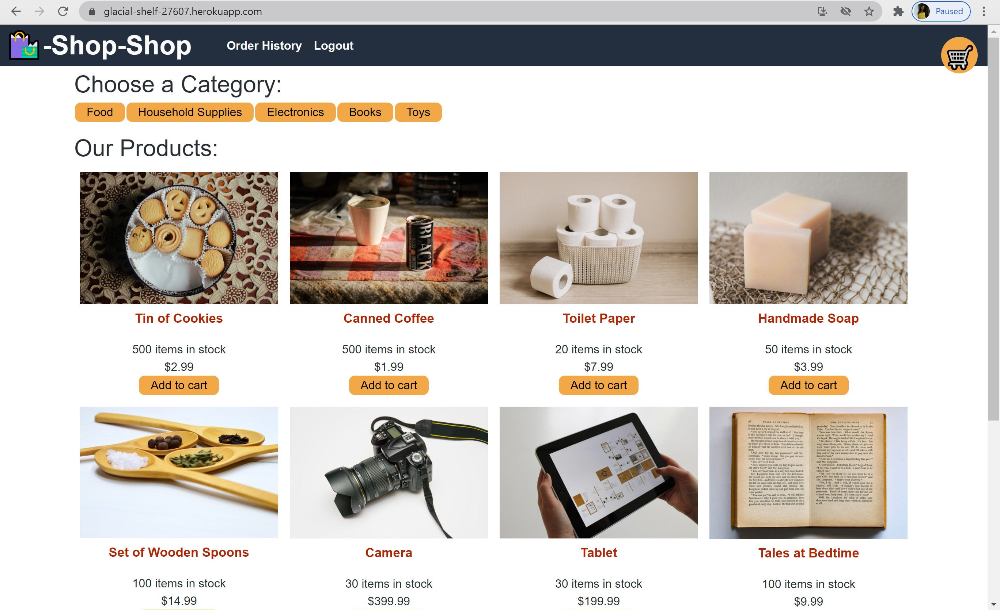
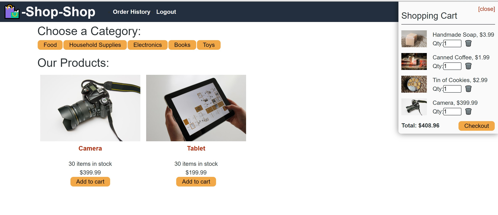
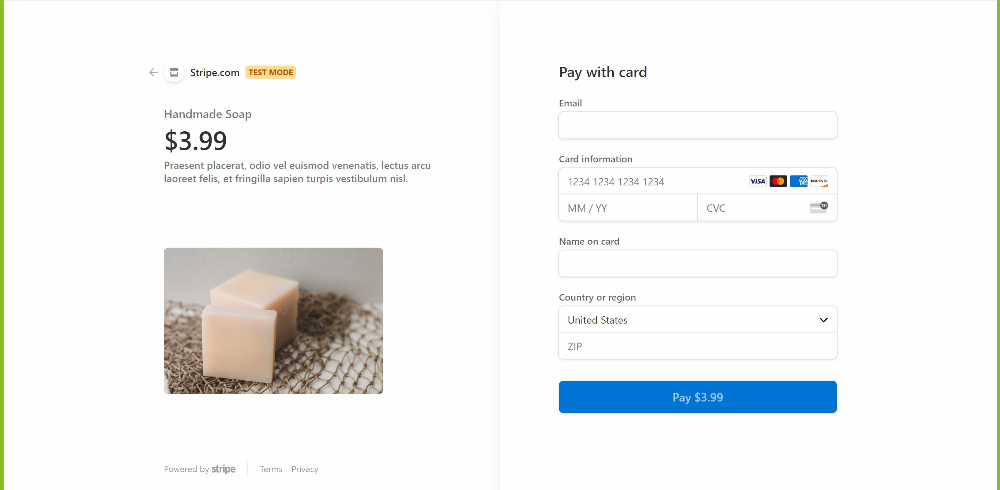

# Redux Store / Shop Shop

## Table of Contents

* [Description](#description)

* [Preview](#preview)

* [Usage](#usage)

* [Questions](#questions)

## Description

* A refactored eEcommerce platform that uses MongoDB, ExpressJS, ReactJS, NodeJS, Redux and stripe.   

* You can view the deployed site at [Heroku](https://glacial-shelf-27607.herokuapp.com/).

## Preview

* Main Page

* Shopping Cart

* Stripe Checkout 

## Usage

* For development, simply install all dependencies by running `npm install` in the root, client,and server terminals. Follow by seeding using run `npm run seed`.  Run `npm start` to begin running the application.  

* To use the deployed app, simply visit the heroku deployed link, create a user in the sign up form, and shop.  Upon checking out, you will be taken to the checkout page using stripe.

## Questions

If you have questions about this project, or if you would like to contribute, visit our repo at [GitHub](https://github.com/VSLG2020/Redux_Shop.git)